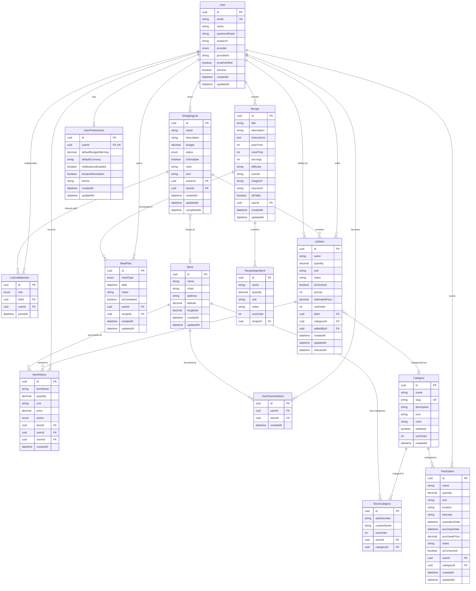

# Database Schema Documentation

**Project:** Listly - Smart Shopping Companion
**Database:** PostgreSQL 16
**ORM:** Prisma 5.14.0
**Last Updated:** 2026-02-09

> **Note:** To view the Mermaid diagram below as a visual graph, use VS Code's Markdown Preview (Ctrl+Shift+V / Cmd+Shift+V) or install the "Markdown Preview Mermaid Support" extension.

---

## Overview

The Listly database schema is designed to support a mobile-first PWA for smart shopping list management with real-time collaboration, AI suggestions, and pantry tracking. The schema follows Third Normal Form (3NF) normalization principles to minimize data redundancy and maintain integrity.

---

## Entity Relationship Diagram



---

## Tables

### users

**Purpose:** Stores user authentication and profile information.

| Column         | Type      | Constraints               | Description                                    |
| -------------- | --------- | ------------------------- | ---------------------------------------------- |
| id             | CUID      | PK                        | Unique identifier                              |
| email          | VARCHAR   | UNIQUE, NOT NULL          | User email address                             |
| name           | VARCHAR   | NOT NULL                  | Display name                                   |
| password_hash  | VARCHAR   | NULL                      | Hashed password (null for OAuth-only users)    |
| avatar_url     | VARCHAR   | NULL                      | Profile picture URL                            |
| provider       | ENUM      | NOT NULL, DEFAULT 'EMAIL' | Authentication provider (EMAIL, GOOGLE, APPLE) |
| provider_id    | VARCHAR   | NULL                      | OAuth provider's user ID                       |
| email_verified | BOOLEAN   | NOT NULL, DEFAULT false   | Email verification status                      |
| is_active      | BOOLEAN   | NOT NULL, DEFAULT true    | Account active status                          |
| created_at     | TIMESTAMP | NOT NULL, DEFAULT NOW     | Account creation time                          |
| updated_at     | TIMESTAMP | NOT NULL                  | Last profile update                            |

**Indexes:**

- `idx_users_email` on (email)
- `idx_users_provider` on (provider, provider_id)

---

### user_preferences

**Purpose:** Stores user-specific settings and preferences.

| Column                 | Type          | Constraints                | Description                     |
| ---------------------- | ------------- | -------------------------- | ------------------------------- |
| id                     | CUID          | PK                         | Unique identifier               |
| user_id                | CUID          | FK, UNIQUE, NOT NULL       | References users(id)            |
| default_budget_warning | DECIMAL(10,2) | NULL                       | Budget warning threshold        |
| default_currency       | VARCHAR       | NOT NULL, DEFAULT 'USD'    | Preferred currency              |
| notifications_enabled  | BOOLEAN       | NOT NULL, DEFAULT true     | Enable notifications            |
| location_reminders     | BOOLEAN       | NOT NULL, DEFAULT false    | Enable location-based reminders |
| theme                  | VARCHAR       | NOT NULL, DEFAULT 'system' | UI theme (light/dark/system)    |
| created_at             | TIMESTAMP     | NOT NULL, DEFAULT NOW      | Creation time                   |
| updated_at             | TIMESTAMP     | NOT NULL                   | Last update                     |

**Constraints:**

- Foreign key: user_id REFERENCES users(id) ON DELETE CASCADE

---

### shopping_lists

**Purpose:** Stores shopping lists created by users.

| Column       | Type          | Constraints                | Description                               |
| ------------ | ------------- | -------------------------- | ----------------------------------------- |
| id           | CUID          | PK                         | Unique identifier                         |
| name         | VARCHAR       | NOT NULL                   | List name                                 |
| description  | TEXT          | NULL                       | Optional description                      |
| budget       | DECIMAL(10,2) | NULL                       | Budget limit for this list                |
| status       | ENUM          | NOT NULL, DEFAULT 'ACTIVE' | List status (ACTIVE, COMPLETED, ARCHIVED) |
| is_template  | BOOLEAN       | NOT NULL, DEFAULT false    | Template flag for reusable lists          |
| color        | VARCHAR       | NULL                       | Hex color for UI customization            |
| icon         | VARCHAR       | NULL                       | Icon identifier                           |
| owner_id     | CUID          | FK, NOT NULL               | References users(id)                      |
| store_id     | CUID          | FK, NULL                   | References stores(id)                     |
| created_at   | TIMESTAMP     | NOT NULL, DEFAULT NOW      | Creation time                             |
| updated_at   | TIMESTAMP     | NOT NULL                   | Last update                               |
| completed_at | TIMESTAMP     | NULL                       | Completion time                           |

**Indexes:**

- `idx_shopping_lists_owner` on (owner_id)
- `idx_shopping_lists_status` on (status)
- `idx_shopping_lists_store` on (store_id)
- `idx_shopping_lists_created` on (created_at)

**Constraints:**

- Foreign key: owner_id REFERENCES users(id) ON DELETE CASCADE
- Foreign key: store_id REFERENCES stores(id) ON DELETE SET NULL

---

### list_items

**Purpose:** Individual items within shopping lists.

| Column          | Type          | Constraints             | Description                              |
| --------------- | ------------- | ----------------------- | ---------------------------------------- |
| id              | CUID          | PK                      | Unique identifier                        |
| name            | VARCHAR       | NOT NULL                | Item name                                |
| quantity        | DECIMAL(10,2) | NOT NULL, DEFAULT 1     | Quantity to purchase                     |
| unit            | VARCHAR       | NULL                    | Unit of measurement (kg, lbs, pcs, etc.) |
| notes           | TEXT          | NULL                    | Additional notes                         |
| is_checked      | BOOLEAN       | NOT NULL, DEFAULT false | Checked off status                       |
| priority        | INT           | NOT NULL, DEFAULT 0     | Priority (higher = more important)       |
| estimated_price | DECIMAL(10,2) | NULL                    | Estimated price                          |
| sort_order      | INT           | NOT NULL, DEFAULT 0     | Manual sort order                        |
| list_id         | CUID          | FK, NOT NULL            | References shopping_lists(id)            |
| category_id     | CUID          | FK, NULL                | References categories(id)                |
| added_by_id     | CUID          | FK, NOT NULL            | References users(id)                     |
| created_at      | TIMESTAMP     | NOT NULL, DEFAULT NOW   | Creation time                            |
| updated_at      | TIMESTAMP     | NOT NULL                | Last update                              |
| checked_at      | TIMESTAMP     | NULL                    | When item was checked off                |

**Indexes:**

- `idx_list_items_list` on (list_id)
- `idx_list_items_category` on (category_id)
- `idx_list_items_checked` on (is_checked)
- `idx_list_items_sort` on (list_id, sort_order)

**Constraints:**

- Foreign key: list_id REFERENCES shopping_lists(id) ON DELETE CASCADE
- Foreign key: category_id REFERENCES categories(id) ON DELETE SET NULL
- Foreign key: added_by_id REFERENCES users(id)

---

### list_collaborators

**Purpose:** Many-to-many relationship for shared lists with role-based permissions.

| Column    | Type      | Constraints                | Description                               |
| --------- | --------- | -------------------------- | ----------------------------------------- |
| id        | CUID      | PK                         | Unique identifier                         |
| role      | ENUM      | NOT NULL, DEFAULT 'EDITOR' | Collaborator role (VIEWER, EDITOR, ADMIN) |
| list_id   | CUID      | FK, NOT NULL               | References shopping_lists(id)             |
| user_id   | CUID      | FK, NOT NULL               | References users(id)                      |
| joined_at | TIMESTAMP | NOT NULL, DEFAULT NOW      | When user joined as collaborator          |

**Indexes:**

- `idx_list_collaborators_user` on (user_id)
- `idx_list_collaborators_list` on (list_id)

**Constraints:**

- Unique constraint on (list_id, user_id)
- Foreign key: list_id REFERENCES shopping_lists(id) ON DELETE CASCADE
- Foreign key: user_id REFERENCES users(id) ON DELETE CASCADE

---

### categories

**Purpose:** Item categorization for organization and aisle navigation.

| Column      | Type      | Constraints             | Description             |
| ----------- | --------- | ----------------------- | ----------------------- |
| id          | CUID      | PK                      | Unique identifier       |
| name        | VARCHAR   | NOT NULL                | Category name           |
| slug        | VARCHAR   | UNIQUE, NOT NULL        | URL-friendly identifier |
| description | TEXT      | NULL                    | Category description    |
| icon        | VARCHAR   | NULL                    | Icon identifier         |
| color       | VARCHAR   | NULL                    | Hex color for UI        |
| is_default  | BOOLEAN   | NOT NULL, DEFAULT false | System default category |
| sort_order  | INT       | NOT NULL, DEFAULT 0     | Display order           |
| created_at  | TIMESTAMP | NOT NULL, DEFAULT NOW   | Creation time           |

**Indexes:**

- `idx_categories_slug` on (slug)
- `idx_categories_sort` on (sort_order)

---

### stores

**Purpose:** Store locations for price tracking and location reminders.

| Column     | Type          | Constraints           | Description                                 |
| ---------- | ------------- | --------------------- | ------------------------------------------- |
| id         | CUID          | PK                    | Unique identifier                           |
| name       | VARCHAR       | NOT NULL              | Store name                                  |
| chain      | VARCHAR       | NULL                  | Store chain (e.g., "Whole Foods", "Costco") |
| address    | TEXT          | NULL                  | Full address                                |
| latitude   | DECIMAL(10,8) | NULL                  | Geographic latitude                         |
| longitude  | DECIMAL(11,8) | NULL                  | Geographic longitude                        |
| created_at | TIMESTAMP     | NOT NULL, DEFAULT NOW | Creation time                               |
| updated_at | TIMESTAMP     | NOT NULL              | Last update                                 |

**Indexes:**

- `idx_stores_location` on (latitude, longitude)

---

### store_categories

**Purpose:** Custom aisle mappings per store for personalized navigation.

| Column       | Type    | Constraints         | Description                         |
| ------------ | ------- | ------------------- | ----------------------------------- |
| id           | CUID    | PK                  | Unique identifier                   |
| aisle_number | VARCHAR | NULL                | Physical aisle number (e.g., "5A")  |
| custom_name  | VARCHAR | NULL                | Custom category name for this store |
| sort_order   | INT     | NOT NULL, DEFAULT 0 | Aisle order within store            |
| store_id     | CUID    | FK, NOT NULL        | References stores(id)               |
| category_id  | CUID    | FK, NOT NULL        | References categories(id)           |

**Indexes:**

- `idx_store_categories_store` on (store_id)

**Constraints:**

- Unique constraint on (store_id, category_id)
- Foreign key: store_id REFERENCES stores(id) ON DELETE CASCADE
- Foreign key: category_id REFERENCES categories(id) ON DELETE CASCADE

---

### user_favorite_stores

**Purpose:** User's preferred stores for quick access and filtering.

| Column     | Type      | Constraints           | Description           |
| ---------- | --------- | --------------------- | --------------------- |
| id         | CUID      | PK                    | Unique identifier     |
| user_id    | CUID      | FK, NOT NULL          | References users(id)  |
| store_id   | CUID      | FK, NOT NULL          | References stores(id) |
| created_at | TIMESTAMP | NOT NULL, DEFAULT NOW | When favorited        |

**Indexes:**

- `idx_user_favorite_stores_user` on (user_id)

**Constraints:**

- Unique constraint on (user_id, store_id)
- Foreign key: user_id REFERENCES users(id) ON DELETE CASCADE
- Foreign key: store_id REFERENCES stores(id) ON DELETE CASCADE

---

### item_history

**Purpose:** Historical record of item purchases and price tracking.

| Column     | Type          | Constraints           | Description                                                     |
| ---------- | ------------- | --------------------- | --------------------------------------------------------------- |
| id         | CUID          | PK                    | Unique identifier                                               |
| item_name  | VARCHAR       | NOT NULL              | Item name (denormalized for history)                            |
| quantity   | DECIMAL(10,2) | NOT NULL              | Quantity purchased                                              |
| unit       | VARCHAR       | NULL                  | Unit of measurement                                             |
| price      | DECIMAL(10,2) | NULL                  | Purchase price                                                  |
| action     | ENUM          | NOT NULL              | Action type (ADDED, CHECKED, UNCHECKED, REMOVED, PRICE_UPDATED) |
| item_id    | CUID          | FK, NULL              | References list_items(id) (nullable if deleted)                 |
| user_id    | CUID          | FK, NOT NULL          | References users(id)                                            |
| store_id   | CUID          | FK, NULL              | References stores(id)                                           |
| created_at | TIMESTAMP     | NOT NULL, DEFAULT NOW | Event time                                                      |

**Indexes:**

- `idx_item_history_item` on (item_id)
- `idx_item_history_user` on (user_id)
- `idx_item_history_name` on (item_name)
- `idx_item_history_store_price` on (store_id, item_name, created_at) - For price trend queries

**Constraints:**

- Foreign key: item_id REFERENCES list_items(id) ON DELETE SET NULL
- Foreign key: user_id REFERENCES users(id) ON DELETE CASCADE
- Foreign key: store_id REFERENCES stores(id) ON DELETE SET NULL

---

### pantry_items

**Purpose:** User's home inventory tracking and expiration management.

| Column          | Type          | Constraints             | Description                                         |
| --------------- | ------------- | ----------------------- | --------------------------------------------------- |
| id              | CUID          | PK                      | Unique identifier                                   |
| name            | VARCHAR       | NOT NULL                | Item name                                           |
| quantity        | DECIMAL(10,2) | NOT NULL                | Current quantity                                    |
| unit            | VARCHAR       | NULL                    | Unit of measurement                                 |
| location        | VARCHAR       | NULL                    | Storage location (fridge, freezer, pantry, cabinet) |
| barcode         | VARCHAR       | NULL                    | Product barcode                                     |
| expiration_date | DATE          | NULL                    | Expiration date                                     |
| purchase_date   | DATE          | NULL                    | Purchase date                                       |
| purchase_price  | DECIMAL(10,2) | NULL                    | Purchase price                                      |
| notes           | TEXT          | NULL                    | Additional notes                                    |
| is_consumed     | BOOLEAN       | NOT NULL, DEFAULT false | Consumed status                                     |
| user_id         | CUID          | FK, NOT NULL            | References users(id)                                |
| category_id     | CUID          | FK, NULL                | References categories(id)                           |
| created_at      | TIMESTAMP     | NOT NULL, DEFAULT NOW   | Creation time                                       |
| updated_at      | TIMESTAMP     | NOT NULL                | Last update                                         |

**Indexes:**

- `idx_pantry_items_user` on (user_id)
- `idx_pantry_items_category` on (category_id)
- `idx_pantry_items_expiration` on (expiration_date)
- `idx_pantry_items_barcode` on (barcode)
- `idx_pantry_items_location` on (location)

**Constraints:**

- Foreign key: user_id REFERENCES users(id) ON DELETE CASCADE
- Foreign key: category_id REFERENCES categories(id) ON DELETE SET NULL

---

### recipes

**Purpose:** User's recipe collection for meal planning.

| Column       | Type      | Constraints             | Description                           |
| ------------ | --------- | ----------------------- | ------------------------------------- |
| id           | CUID      | PK                      | Unique identifier                     |
| title        | VARCHAR   | NOT NULL                | Recipe title                          |
| description  | TEXT      | NULL                    | Recipe description                    |
| instructions | TEXT      | NOT NULL                | Cooking instructions                  |
| prep_time    | INT       | NULL                    | Preparation time in minutes           |
| cook_time    | INT       | NULL                    | Cooking time in minutes               |
| servings     | INT       | NULL                    | Number of servings                    |
| difficulty   | VARCHAR   | NULL                    | Difficulty level (easy, medium, hard) |
| cuisine      | VARCHAR   | NULL                    | Cuisine type                          |
| image_url    | VARCHAR   | NULL                    | Recipe image URL                      |
| source_url   | VARCHAR   | NULL                    | Source URL if imported                |
| is_public    | BOOLEAN   | NOT NULL, DEFAULT false | Public visibility                     |
| user_id      | CUID      | FK, NOT NULL            | References users(id)                  |
| created_at   | TIMESTAMP | NOT NULL, DEFAULT NOW   | Creation time                         |
| updated_at   | TIMESTAMP | NOT NULL                | Last update                           |

**Indexes:**

- `idx_recipes_user` on (user_id)
- `idx_recipes_cuisine` on (cuisine)

**Constraints:**

- Foreign key: user_id REFERENCES users(id) ON DELETE CASCADE

---

### recipe_ingredients

**Purpose:** Ingredients list for each recipe.

| Column     | Type          | Constraints         | Description            |
| ---------- | ------------- | ------------------- | ---------------------- |
| id         | CUID          | PK                  | Unique identifier      |
| name       | VARCHAR       | NOT NULL            | Ingredient name        |
| quantity   | DECIMAL(10,2) | NOT NULL            | Quantity needed        |
| unit       | VARCHAR       | NULL                | Unit of measurement    |
| notes      | TEXT          | NULL                | Additional notes       |
| sort_order | INT           | NOT NULL, DEFAULT 0 | Display order          |
| recipe_id  | CUID          | FK, NOT NULL        | References recipes(id) |

**Indexes:**

- `idx_recipe_ingredients_recipe` on (recipe_id)

**Constraints:**

- Foreign key: recipe_id REFERENCES recipes(id) ON DELETE CASCADE

---

### meal_plans

**Purpose:** Weekly meal planning calendar.

| Column       | Type      | Constraints             | Description                                 |
| ------------ | --------- | ----------------------- | ------------------------------------------- |
| id           | CUID      | PK                      | Unique identifier                           |
| meal_type    | ENUM      | NOT NULL                | Meal type (BREAKFAST, LUNCH, DINNER, SNACK) |
| date         | DATE      | NOT NULL                | Scheduled date                              |
| notes        | TEXT      | NULL                    | Planning notes                              |
| is_completed | BOOLEAN   | NOT NULL, DEFAULT false | Completion status                           |
| user_id      | CUID      | FK, NOT NULL            | References users(id)                        |
| recipe_id    | CUID      | FK, NULL                | References recipes(id)                      |
| created_at   | TIMESTAMP | NOT NULL, DEFAULT NOW   | Creation time                               |
| updated_at   | TIMESTAMP | NOT NULL                | Last update                                 |

**Indexes:**

- `idx_meal_plans_user` on (user_id)
- `idx_meal_plans_date` on (date)
- `idx_meal_plans_user_date` on (user_id, date) - For calendar queries

**Constraints:**

- Foreign key: user_id REFERENCES users(id) ON DELETE CASCADE
- Foreign key: recipe_id REFERENCES recipes(id) ON DELETE SET NULL

---

## Enumerations

### AuthProvider

- `EMAIL` - Email/password authentication
- `GOOGLE` - Google OAuth
- `APPLE` - Apple Sign-In

### ListStatus

- `ACTIVE` - Currently in use
- `COMPLETED` - Shopping trip finished
- `ARCHIVED` - Historical list

### CollaboratorRole

- `VIEWER` - Can view list
- `EDITOR` - Can view and modify list
- `ADMIN` - Full permissions including sharing

### ItemAction

- `ADDED` - Item added to list
- `CHECKED` - Item checked off
- `UNCHECKED` - Item unchecked
- `REMOVED` - Item removed from list
- `PRICE_UPDATED` - Price information updated

### MealType

- `BREAKFAST`
- `LUNCH`
- `DINNER`
- `SNACK`

---

## Key Relationships

### User-Centric Relationships

- **User → ShoppingLists**: One-to-Many (owner_id)
- **User ↔ ShoppingLists**: Many-to-Many via ListCollaborator (shared lists)
- **User → PantryItems**: One-to-Many
- **User → Recipes**: One-to-Many
- **User → MealPlans**: One-to-Many
- **User ↔ Stores**: Many-to-Many via UserFavoriteStore

### Shopping List Relationships

- **ShoppingList → ListItems**: One-to-Many with CASCADE delete
- **ShoppingList → ListCollaborators**: One-to-Many with CASCADE delete
- **ShoppingList → Store**: Many-to-One (optional)

### Item Categorization

- **ListItem → Category**: Many-to-One (optional)
- **PantryItem → Category**: Many-to-One (optional)
- **Store → Categories**: Many-to-Many via StoreCategory (custom aisle mapping)

### Historical Tracking

- **ListItem → ItemHistory**: One-to-Many (price and completion history)
- **ItemHistory**: Denormalizes item_name for historical data retention

### Meal Planning

- **Recipe → RecipeIngredients**: One-to-Many with CASCADE delete
- **MealPlan → Recipe**: Many-to-One (optional)

---

## Normalization & Data Integrity

### Normalization Level

The schema follows **Third Normal Form (3NF)**:

1. **First Normal Form (1NF)**: All attributes contain atomic values
2. **Second Normal Form (2NF)**: No partial dependencies on composite keys
3. **Third Normal Form (3NF)**: No transitive dependencies

### Denormalization Exceptions

- `item_history.item_name`: Denormalized to preserve historical data if item is deleted
- Future consideration: Materialized views for aggregated analytics

### Referential Integrity

**CASCADE Deletes:**

- User deletion cascades to all owned data (lists, pantry, recipes, preferences)
- List deletion cascades to items and collaborators
- Recipe deletion cascades to ingredients

**SET NULL:**

- Store deletion sets store_id to NULL on lists (list remains valid)
- Category deletion sets category_id to NULL (item remains valid)
- Item deletion sets item_id to NULL in history (history preserved)

---

## Indexing Strategy

### Primary Indexes

- All primary keys (`id` columns) are automatically indexed
- All foreign keys have dedicated indexes for JOIN performance

### Query-Optimized Indexes

1. **User lookups**: email, (provider, provider_id)
2. **List filtering**: owner_id, status, created_at
3. **Item sorting**: (list_id, sort_order)
4. **Price history**: (store_id, item_name, created_at)
5. **Pantry expiration**: expiration_date
6. **Meal planning**: (user_id, date)
7. **Location search**: (latitude, longitude)

### Composite Indexes

- `(list_id, sort_order)` - Efficient item ordering within lists
- `(user_id, date)` - Fast meal plan calendar queries
- `(store_id, item_name, created_at)` - Price trend analysis

---

## Query Patterns

### Common Queries

**1. Get user's active lists with item counts:**

```sql
SELECT
  sl.id, sl.name, sl.budget, sl.status,
  COUNT(li.id) as item_count,
  SUM(CASE WHEN li.is_checked THEN 1 ELSE 0 END) as checked_count
FROM shopping_lists sl
LEFT JOIN list_items li ON sl.id = li.list_id
WHERE sl.owner_id = $1 AND sl.status = 'ACTIVE'
GROUP BY sl.id
ORDER BY sl.created_at DESC;
```

**2. Get shopping list with items grouped by category:**

```sql
SELECT
  c.name as category, c.sort_order,
  li.id, li.name, li.quantity, li.unit, li.is_checked
FROM list_items li
LEFT JOIN categories c ON li.category_id = c.id
WHERE li.list_id = $1
ORDER BY c.sort_order, li.sort_order;
```

**3. Price history for an item across stores:**

```sql
SELECT
  s.name as store_name,
  ih.price,
  ih.created_at
FROM item_history ih
JOIN stores s ON ih.store_id = s.id
WHERE ih.item_name = $1
  AND ih.action = 'CHECKED'
  AND ih.price IS NOT NULL
ORDER BY ih.created_at DESC
LIMIT 10;
```

**4. Expiring pantry items (next 7 days):**

```sql
SELECT
  pi.name, pi.quantity, pi.unit, pi.expiration_date,
  c.name as category
FROM pantry_items pi
LEFT JOIN categories c ON pi.category_id = c.id
WHERE pi.user_id = $1
  AND pi.is_consumed = false
  AND pi.expiration_date BETWEEN CURRENT_DATE AND CURRENT_DATE + INTERVAL '7 days'
ORDER BY pi.expiration_date ASC;
```

**5. Generate shopping list from meal plan:**

```sql
SELECT DISTINCT
  ri.name,
  SUM(ri.quantity) as total_quantity,
  ri.unit,
  c.id as category_id
FROM meal_plans mp
JOIN recipe_ingredients ri ON mp.recipe_id = ri.recipe_id
LEFT JOIN categories c ON c.name = ri.name  -- Simplified; real impl uses lookup
WHERE mp.user_id = $1
  AND mp.date BETWEEN $2 AND $3
  AND mp.is_completed = false
GROUP BY ri.name, ri.unit, c.id
ORDER BY ri.name;
```

---

## Performance Considerations

### Read Optimization (90% of queries)

- Indexed foreign keys for fast JOINs
- Composite indexes for common WHERE + ORDER BY patterns
- Future: Read replicas for analytics queries

### Write Optimization (10% of queries)

- Minimal indexes on write-heavy tables (item_history)
- Batch inserts for meal plan → shopping list generation
- Optimistic locking for real-time collaboration conflicts

### Scalability Strategies

1. **Partitioning**: item_history by created_at (monthly partitions)
2. **Archiving**: Move COMPLETED lists older than 1 year to archive table
3. **Caching**: Redis for frequently accessed lists and categories
4. **Connection Pooling**: Supabase Supavisor for concurrent users

---

## Data Retention & Archival

| Table          | Retention Policy       | Archival Strategy                            |
| -------------- | ---------------------- | -------------------------------------------- |
| shopping_lists | Indefinite (user data) | Move ARCHIVED lists > 1 year to cold storage |
| list_items     | Cascade with lists     | Included in list archival                    |
| item_history   | 2 years active         | Partition by month, archive older data       |
| pantry_items   | Indefinite             | Soft delete (is_consumed flag)               |
| recipes        | Indefinite             | User-owned content                           |
| meal_plans     | 1 year                 | Archive completed plans > 1 year             |

---

## Security Considerations

### Row-Level Security (Supabase RLS)

- Users can only access their own data
- Shared lists visible to collaborators
- Public recipes visible to all (if is_public = true)

### Sensitive Data

- `password_hash`: Hashed with bcrypt/argon2
- `provider_id`: OAuth provider's user ID (not sensitive)
- No PII beyond email (GDPR compliant)

### Audit Trail

- `created_at`, `updated_at` timestamps on all tables
- `item_history` provides action audit trail
- Future: Add `deleted_at` for soft deletes if needed

---

## Future Enhancements

### Potential Schema Additions

1. **Notifications Table**: Store push notification history
2. **Tags**: Flexible tagging system for lists and items
3. **AI Suggestions Cache**: Store ML-generated suggestions
4. **Product Catalog**: External product database with barcodes
5. **User Activity Log**: Detailed action tracking for analytics
6. **Shared Recipe Collections**: Community recipe sharing

### Optimization Opportunities

1. Materialized views for spending analytics
2. Full-text search indexes on item names
3. PostGIS extension for advanced location features
4. Time-series data optimization for price history

---

## Related Documentation

- [Database Decision](./database-decision.md) - Why PostgreSQL + Supabase
- [Requirements](../requirements.md) - User stories and features
- [Project Structure](../architecture/project-structure.md) - Code organization
- [Prisma Schema](../../prisma/schema.prisma) - Source of truth

---

## Change Log

| Version | Date       | Author   | Changes                           |
| ------- | ---------- | -------- | --------------------------------- |
| 1.0     | 2026-02-09 | AI Agent | Initial schema design for SOP-101 |
