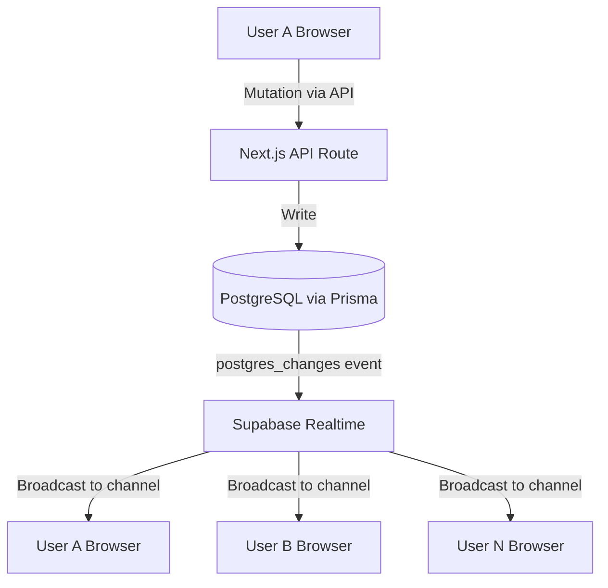

# Supabase Real-Time Design — US-007

> **Date:** 2026-02-12
> **User Story:** US-007 — As a user, I want to collaborate on shared lists in real-time
> **Status:** Design (not yet implemented)

---

## Overview

Real-time collaboration allows multiple users to see changes on a shared shopping list instantly — item additions, check/uncheck, deletions, and reordering — without requiring manual refresh.

## Architecture



### Channel Strategy

| Channel                  | Pattern                             | Purpose                                  |
| ------------------------ | ----------------------------------- | ---------------------------------------- |
| `list:{listId}`          | `postgres_changes` on `items` table | Item CRUD (add, update, delete, reorder) |
| `list:{listId}:presence` | Presence                            | Show who's viewing/editing the list      |
| `list:{listId}:typing`   | Broadcast                           | Show "User is typing…" indicators        |

### Event Types

| Event                         | Payload                       | UI Effect                                     |
| ----------------------------- | ----------------------------- | --------------------------------------------- |
| `INSERT` on `items`           | `{ item, userId }`            | Animate new item in, show "Added by X" toast  |
| `UPDATE` on `items` (checked) | `{ itemId, checked, userId }` | Check/uncheck animation with user attribution |
| `UPDATE` on `items` (reorder) | `{ itemId, position }`        | Smooth reorder animation                      |
| `DELETE` on `items`           | `{ itemId, userId }`          | Fade-out animation, show "Deleted by X" toast |
| Presence `join`               | `{ userId, name, avatar }`    | Show avatar in header collaboration indicator |
| Presence `leave`              | `{ userId }`                  | Remove avatar from indicator                  |

## Frontend Hooks

### `useRealtimeList(listId: string)`

```typescript
// Subscribes to list channel, returns cleanup
function useRealtimeList(listId: string) {
  // 1. Create Supabase channel: `list:${listId}`
  // 2. Subscribe to postgres_changes for items WHERE list_id = listId
  // 3. On INSERT → invalidate TanStack Query cache for items
  // 4. On UPDATE → optimistically update item in cache
  // 5. On DELETE → remove item from cache
  // 6. Return unsubscribe cleanup
}
```

### `useRealtimePresence(listId: string)`

```typescript
// Tracks who's currently viewing the list
function useRealtimePresence(listId: string) {
  // 1. Join presence on `list:${listId}:presence`
  // 2. Track current user { id, name, avatar }
  // 3. Return presenceState: Map<userId, { name, avatar, lastSeen }>
  // 4. Show up to 3 avatars + "+N" overflow in list header
}
```

## Optimistic Updates & Conflict Resolution

| Scenario                        | Strategy                                                          |
| ------------------------------- | ----------------------------------------------------------------- |
| Local user adds item            | Optimistic insert → confirmed by server event                     |
| Remote user adds item           | Cache invalidation → refetch items                                |
| Simultaneous edits to same item | **Last-write-wins** — server timestamp is source of truth         |
| Network disconnect              | Show "Reconnecting…" banner, queue mutations, replay on reconnect |
| Stale cache                     | Full refetch on channel reconnect                                 |

## UI Animation Specs (from `interactions.md` §9)

- **Remote item added:** Blue glow animation (`animate-glow`), 2s duration
- **Remote item checked:** Standard check animation with user name attribution text
- **Presence join:** Avatar slides in from right with `animate-slide-in-top`
- **Presence leave:** Avatar fades out with `animate-fade-in` (reverse)
- **Collaboration indicator:** Pulsing dot next to shared list title

## Dependencies

- `@supabase/supabase-js` (already in `package.json`)
- Supabase project with Realtime enabled
- `NEXT_PUBLIC_SUPABASE_URL` and `NEXT_PUBLIC_SUPABASE_ANON_KEY` env vars

## Implementation Order

1. Create `src/lib/supabase/client.ts` — browser Supabase client singleton
2. Create `src/hooks/useRealtimeList.ts` — channel subscription hook
3. Create `src/hooks/useRealtimePresence.ts` — presence tracking hook
4. Integrate into `ListDetailPage` — wire hooks into existing list detail
5. Create `CollaborationIndicator` component — avatar stack in list header
6. Test with two browser tabs on the same shared list
